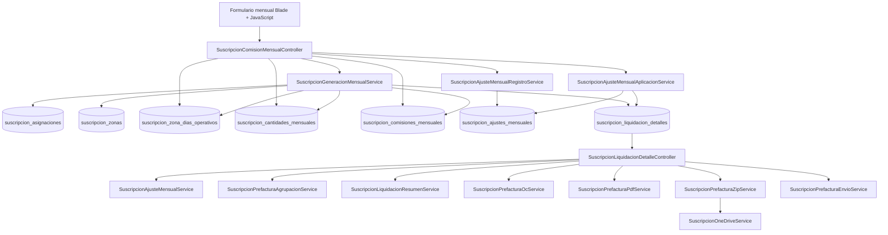
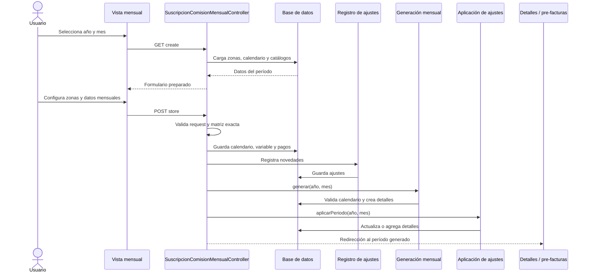
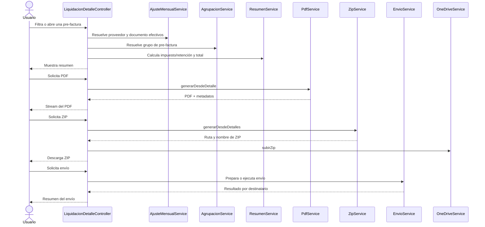

# Arquitectura del módulo Suscripciones

## 1. Propósito de este documento

Este documento describe la arquitectura funcional y técnica del módulo
**Suscripciones** del proyecto Laravel.

Su objetivo es permitir que una persona desarrolladora o un agente como Codex
pueda:

- entender la distribución de responsabilidades;
- seguir el recorrido de los datos desde el formulario hasta la pre-factura;
- identificar qué componente es responsable de cada decisión;
- reconocer dependencias entre controladores, servicios, modelos, vistas y
  persistencia;
- detectar duplicación de lógica o caminos de ejecución que puedan divergir;
- evaluar el impacto de una modificación antes de editar código;
- buscar errores, regresiones, inconsistencias y riesgos sin depender de una
  lista cerrada de pruebas.

Este documento **no reemplaza el código ni las migraciones**. El código del
repositorio y el esquema real de la base de datos deben verificarse antes de
aplicar cambios.

Cuando este documento, el código y la base de datos no coincidan, Codex debe
informar la contradicción y determinar cuál representa la conducta vigente
antes de modificar el sistema.

---

## 2. Alcance arquitectónico

El módulo cubre el ciclo completo de liquidación mensual de servicios de
Suscripciones:

1. mantenimiento de asignaciones;
2. selección del período;
3. configuración de calendario operativo por zona;
4. registro de cantidades variables;
5. registro de pagos adicionales;
6. registro de novedades y ajustes mensuales;
7. generación de detalles mensuales;
8. aplicación de ajustes;
9. resolución del proveedor efectivo de facturación;
10. agrupación de líneas en pre-facturas;
11. cálculo tributario;
12. visualización y revisión;
13. generación de PDF;
14. generación de ZIP;
15. revisión de destinatarios;
16. envío de correos de prueba;
17. envío de correos reales;
18. carga de archivos en OneDrive.

El módulo no es únicamente un CRUD. Es un proceso de cálculo mensual con datos
maestros, datos de período, asignaciones técnicas, reglas tributarias y salidas
documentales.

---

## 3. Vista general de la arquitectura

La arquitectura actual sigue principalmente una estructura Laravel clásica:

```text
Navegador
    ↓
Rutas Laravel
    ↓
Controladores HTTP
    ↓
Validación de Request
    ↓
Servicios de dominio/aplicación
    ↓
Modelos Eloquent
    ↓
Base de datos
    ↓
Servicios de resumen y agrupación
    ↓
PDF / ZIP / correo / OneDrive
```

El controlador mensual funciona como orquestador del ingreso de datos y de la
generación.

El servicio de generación crea la base calculada del período.

Los servicios de ajustes registran y aplican cambios posteriores o
complementarios.

Los servicios de pre-factura resuelven agrupación, tributación, presentación y
distribución.

---

## 4. Diagrama de componentes



Este diagrama representa responsabilidades conceptuales. Codex debe revisar las
rutas y firmas reales para confirmar qué métodos están actualmente expuestos.

---

## 5. Capas del módulo

### 5.1. Capa de presentación

Incluye:

- vistas Blade;
- formularios;
- modales;
- botones de acciones;
- scripts JavaScript;
- mensajes de validación y resultado;
- formularios de filtros;
- vistas de pre-facturas;
- vistas PDF.

Responsabilidades:

- recolectar datos del usuario;
- mostrar catálogos;
- serializar arreglos complejos;
- mantener la matriz de zonas y fechas;
- permitir registrar novedades;
- solicitar confirmaciones para operaciones sensibles;
- presentar resultados calculados por el backend.

La capa de presentación no debe decidir fórmulas financieras ni reglas de
generación. Puede estimar valores para ayudar al usuario, pero el backend debe
recalcular y validar los datos definitivos.

### 5.2. Capa HTTP

Incluye principalmente:

- `App\Http\Controllers\SuscripcionComisionMensualController`
- `App\Http\Controllers\SuscripcionLiquidacionDetalleController`

Responsabilidades:

- recibir solicitudes;
- validar forma y existencia básica de datos;
- invocar servicios;
- controlar redirecciones;
- preparar vistas;
- construir respuestas de descarga o streaming;
- transformar errores de dominio en mensajes para el usuario.

Los controladores no deberían convertirse en una segunda implementación de las
reglas del servicio. Cuando exista una fórmula duplicada entre controlador y
servicio, Codex debe determinar qué ruta utiliza cada implementación y si pueden
producir resultados distintos.

### 5.3. Capa de aplicación y dominio

Incluye los servicios de Suscripciones.

Responsabilidades:

- generación mensual;
- registro de ajustes;
- aplicación de ajustes;
- resolución del proveedor efectivo;
- agrupación de pre-facturas;
- resumen tributario;
- generación documental;
- empaquetado;
- distribución;
- integración con OneDrive.

Esta capa debe concentrar las reglas reutilizables y evitar que PDF, correo,
pantalla e index calculen resultados incompatibles.

### 5.4. Capa de persistencia

Incluye:

- modelos Eloquent;
- relaciones;
- consultas;
- migraciones;
- índices;
- restricciones únicas;
- claves foráneas;
- base de datos MariaDB/MySQL.

La base de datos almacena tanto catálogos como hechos mensuales e históricos.

### 5.5. Capa de integraciones y salidas

Incluye:

- DomPDF;
- creación de ZIP;
- correo Laravel;
- clases Mail;
- OneDrive;
- sistema de archivos temporal o persistente.

Las integraciones deben recibir información ya consolidada. No deberían
reinterpretar reglas de agrupación o tributación de manera diferente.

---

## 6. Subdominios internos

El módulo puede entenderse como seis subdominios relacionados.

### 6.1. Catálogos y asignaciones

Define quién presta el servicio, con qué transportista, en qué punto, con qué
código, costo, tipo, grupo y zona.

Entidad central:

- `Asignaciones`
- tabla `suscripcion_asignaciones`

### 6.2. Configuración operativa mensual

Define qué ocurrió en el período antes de generar:

- calendario de zonas;
- cantidades variables;
- pagos adicionales;
- novedades;
- inasistencias;
- reemplazos;
- cambios de facturación.

### 6.3. Motor de generación

Convierte catálogos y datos mensuales en detalles persistidos:

- tabla `suscripcion_liquidacion_detalles`

### 6.4. Motor de ajustes

Modifica o complementa los detalles base según novedades mensuales.

### 6.5. Consolidación y tributación

Determina:

- proveedor efectivo;
- tipo documental;
- grupo de pre-factura;
- impuesto o retención;
- total final.

### 6.6. Distribución documental

Produce y entrega:

- PDF individual;
- ZIP masivo;
- revisión de destinatarios;
- correos de prueba;
- correos reales;
- copia en OneDrive.

---

## 7. Controlador de generación mensual

### 7.1. Clase

```php
App\Http\Controllers\SuscripcionComisionMensualController
```

### 7.2. Rol arquitectónico

Es el orquestador principal del formulario de generación mensual.

No debe considerarse únicamente un controlador de “comisiones”. Actualmente
administra un proceso más amplio:

- calendario zonal;
- cantidades variables;
- pagos adicionales;
- ajustes mensuales;
- generación completa;
- aplicación de novedades.

El nombre histórico de la clase puede ser más estrecho que su responsabilidad
actual.

### 7.3. Método `create(Request $request)`

Responsabilidades confirmadas:

1. obtener `anio` y `mes`;
2. cargar zonas activas ordenadas por `numero_zona`;
3. calcular las fechas de sábado y domingo del período;
4. recuperar registros existentes de
   `suscripcion_zona_dias_operativos`;
5. construir una matriz zona-fecha;
6. marcar por defecto como operativo un registro aún no guardado;
7. calcular si el calendario está:
   - no configurado;
   - completamente configurado;
   - parcialmente configurado;
8. cargar proveedores;
9. cargar transportistas;
10. cargar asignaciones `VARIABLE`;
11. cargar asignaciones disponibles para novedades;
12. excluir `COMISION` y `CONTENEDOR_AJUSTE` como asignaciones base de
    novedades;
13. cargar asignaciones `FIJO_MENSUAL`;
14. cargar conceptos activos de pago variable;
15. renderizar la vista mensual.

Salida principal:

```text
suscripciones.comisiones_mensuales.create
```

Datos relevantes enviados a la vista:

```text
anio
mes
zonas
fechasFinSemana
calendarioZonas
calendarioZonasConfigurado
calendarioZonasIncompleto
proveedores
transportistas
asignacionesCantidadMensual
asignacionesAjustesMensuales
asignacionesFijasMensuales
conceptosPagoVariable
```

### 7.4. Método `store(...)`

Dependencias inyectadas:

```php
SuscripcionGeneracionMensualService
SuscripcionAjusteMensualRegistroService
SuscripcionAjusteMensualAplicacionService
```

Responsabilidades confirmadas:

1. validar año y mes;
2. validar la estructura del calendario zonal;
3. validar cantidades variables;
4. validar pagos adicionales;
5. validar novedades mensuales;
6. normalizar colecciones recibidas;
7. validar la matriz exacta de zonas y fechas;
8. persistir el calendario zona-fecha;
9. persistir cantidad variable;
10. crear pagos adicionales;
11. registrar novedades mensuales;
12. invocar la generación del período;
13. aplicar los ajustes;
14. construir el mensaje de resultado;
15. redirigir al listado del período.

### 7.5. Matriz de calendario

Cada elemento representa:

```text
suscripcion_zona_id + fecha
```

Campos:

```text
suscripcion_zona_id
fecha
hubo_despacho
observacion
```

El controlador debe exigir la matriz completa correspondiente a:

```text
zonas activas × sábados y domingos del período
```

No basta con validar que existan filas. Debe validarse que las combinaciones
recibidas sean exactamente las esperadas, sin faltantes, sobrantes o
duplicados.

### 7.6. Persistencia dentro de transacción

El bloque transaccional confirmado agrupa:

- `updateOrCreate` del calendario zonal;
- creación de la cantidad variable mensual;
- creación de asignaciones técnicas de pagos adicionales;
- creación de registros mensuales de pagos adicionales.

Después del bloque transaccional se ejecutan, en el flujo actual:

- registro de ajustes;
- generación mensual;
- aplicación de ajustes.

Esto significa que el proceso completo no debe asumirse automáticamente como
una única transacción atómica.

Codex debe considerar esta frontera al analizar fallos intermedios, reintentos,
duplicados y estados parciales.

### 7.7. Métodos privados relacionados con calendario

La clase debe contener y utilizar:

```php
obtenerFechasFinSemana(int $anio, int $mes): Collection
```

y:

```php
validarCalendarioZonas(
    Collection $zonasOperativas,
    int $anio,
    int $mes
): void
```

La validación general de novedades es una responsabilidad distinta y no debe
confundirse con la validación del calendario.

---

## 8. Servicio de generación mensual

### 8.1. Clase

```php
App\Services\Suscripciones\SuscripcionGeneracionMensualService
```

### 8.2. Rol arquitectónico

Es la fuente principal para crear los detalles base de un período.

Recibe:

```text
anio
mes
```

Devuelve un resumen con cantidades de:

- registros creados;
- duplicados;
- cantidades variables creadas;
- cantidades variables duplicadas;
- pagos adicionales creados;
- pagos adicionales duplicados;
- OPV omitidas por falta de puntos.

### 8.3. Selección de asignaciones automáticas

El servicio carga asignaciones que:

- tienen `generar_automaticamente` nulo o igual a 1;
- no son `COMISION`;
- no son `CONTENEDOR_AJUSTE`;
- no son `VARIABLE`.

Relaciones precargadas:

```text
transportista
suscripcionProveedor.cobranzaCompra
opvPuntos
zona
```

La precarga evita consultas repetidas y permite resolver reglas de generación.

### 8.4. Construcción del calendario

El servicio vuelve a calcular las fechas exactas de sábado y domingo del
período solicitado.

Luego consulta `suscripcion_zona_dias_operativos` y resume por zona:

```text
fechas_configuradas
dias_con_despacho
```

La generación depende del calendario persistido, no solamente del estado
visual del formulario.

### 8.5. Asignaciones que requieren calendario zonal

Requieren calendario:

- rutas normales;
- OPV con puntos configurados.

No requieren calendario:

- `FIJO_MENSUAL`;
- OPV sin puntos, porque se omiten;
- `VARIABLE`, porque se generan desde su tabla mensual;
- `COMISION`, porque se genera desde pagos adicionales;
- `CONTENEDOR_AJUSTE`, porque es soporte técnico para ajustes.

### 8.6. Validaciones previas a la creación

Antes de insertar detalles automáticos, el servicio debe detectar:

- asignaciones automáticas calendarizadas sin zona;
- zonas utilizadas sin todas las fechas esperadas;
- calendarios incompletos.

Ante errores, lanza una `ValidationException`.

La creación de detalles no debe comenzar si la validación zonal falla.

### 8.7. Idempotencia actual

La generación consulta si ya existe un detalle para:

```text
suscripcion_asignacion_id + anio + mes
```

Cuando existe:

- no lo actualiza;
- no lo recalcula;
- lo contabiliza como duplicado;
- continúa con la siguiente asignación.

Por ello, el servicio es idempotente respecto de nuevas inserciones, pero no es
un recalculador automático.

Guardar nuevamente un calendario no garantiza que los detalles existentes
cambien.

### 8.8. Generación automática

Para cada asignación automática:

1. verificar duplicidad;
2. omitir OPV sin puntos;
3. obtener `q_calendario`:
   - fijo mensual: 1;
   - resto: días con despacho de la zona;
4. calcular detalle;
5. crear `SuscripcionLiquidacionDetalle`.

### 8.9. Generación de cantidades variables

Fuente:

```text
suscripcion_cantidades_mensuales
```

El servicio:

- filtra por año y mes;
- verifica duplicidad por asignación y período;
- crea el detalle usando costo, cantidad y total del registro mensual;
- utiliza `q_calendario = 1`;
- utiliza `q_inasistencia = 0`.

La cantidad variable no se deriva del calendario zonal.

### 8.10. Generación de pagos adicionales

Fuente:

```text
suscripcion_comisiones_mensuales
```

El servicio:

- filtra por año y mes;
- verifica duplicidad por asignación y período;
- crea el detalle usando tarifa, cantidad y total del pago;
- utiliza `q_calendario = 1`;
- utiliza `q_inasistencia = 0`.

### 8.11. Método de cálculo interno

Firma vigente:

```php
private function calcularDetalleMensual(
    Asignaciones $asignacion,
    int $qCalendario,
    int $inasistencias = 0
): array
```

Este método recibe el calendario ya resuelto.

No debe volver a determinar por sí mismo el período ni contar fines de semana.

Responsabilidades:

- normalizar cantidades no negativas;
- calcular fijo mensual;
- calcular OPV;
- calcular ruta normal;
- devolver costo, calendario, inasistencia, cantidad y total.

### 8.12. Detección de tipos especiales

El servicio utiliza métodos auxiliares para:

```text
esAsignacionFijoMensual
esAsignacionOPV
```

OPV puede no estar representada por un tipo exclusivo. Su detección puede
depender de código, servicio, origen u otras características.

Toda modificación de esta detección puede afectar asignaciones históricas.

---

## 9. Registro de ajustes mensuales

### 9.1. Clase

```php
App\Services\Suscripciones\SuscripcionAjusteMensualRegistroService
```

### 9.2. Rol arquitectónico

Transforma las novedades enviadas desde el formulario en registros persistidos.

Responsabilidades conceptuales:

- validar reglas específicas por tipo de ajuste;
- crear o actualizar ajustes mensuales;
- almacenar datos efectivos o instantáneas;
- crear asignaciones técnicas cuando una línea no corresponde a una asignación
  operativa existente;
- reutilizar una asignación técnica cuando la regla lo permita;
- conservar la asociación con el período.

### 9.3. Asignaciones técnicas

Para novedades que agregan líneas nuevas puede utilizar:

```text
CONTENEDOR_AJUSTE
```

Estas asignaciones existen como soporte técnico y no deben incorporarse al
motor automático como rutas.

### 9.4. Separación respecto de aplicación

Registrar un ajuste no equivale necesariamente a modificar el detalle.

La arquitectura separa:

```text
registro del ajuste
```

de:

```text
aplicación del ajuste
```

Codex debe conservar esa separación al analizar reintentos y consistencia.

---

## 10. Aplicación de ajustes mensuales

### 10.1. Clase

```php
App\Services\Suscripciones\SuscripcionAjusteMensualAplicacionService
```

### 10.2. Rol arquitectónico

Aplica los ajustes persistidos sobre los detalles del período.

Método principal conocido:

```php
aplicarPeriodo(int $anio, int $mes)
```

### 10.3. Comportamiento general

Según el tipo de ajuste, el servicio puede:

- actualizar un detalle existente;
- crear una línea adicional;
- modificar inasistencia;
- modificar cantidad;
- modificar costo;
- modificar total;
- trasladar información efectiva;
- utilizar una asignación técnica;
- recalcular una ruta u OPV.

### 10.4. Inasistencia individual

Una inasistencia:

- se aplica a una asignación específica;
- conserva el `q_calendario` zonal ya generado;
- modifica `q_inasistencia`;
- recalcula cantidad y total;
- no debe alterar el calendario de toda la zona.

Cuando el ajuste no informa `q_calendario`, debe preservarse el del detalle.

### 10.5. OPV durante ajustes

La recalculación OPV debe considerar:

```text
(q_calendario - q_inasistencia) × cantidad de puntos OPV
```

No debe tratar una OPV como una ruta de una sola unidad por día.

### 10.6. Líneas adicionales

Las líneas adicionales no dependen necesariamente del calendario. Sus cantidades
y costos pueden ser explícitos.

---

## 11. Resolución de ajustes efectivos

### 11.1. Clase

```php
App\Services\Suscripciones\SuscripcionAjusteMensualService
```

### 11.2. Rol arquitectónico

Resuelve información efectiva de una línea cuando la configuración mensual
cambia respecto de la asignación base.

Responsabilidades conocidas:

- resolver proveedor de facturación efectivo;
- resolver transportista efectivo;
- resolver tipo de documento efectivo;
- recuperar ajustes relevantes para un detalle;
- permitir que filtros y agrupaciones usen datos ajustados.

### 11.3. Proveedor base versus proveedor efectivo

La asignación conserva su proveedor base.

Un ajuste mensual puede indicar que, para un período concreto, la pre-factura
debe emitirse a otro proveedor.

Por ello, las consultas de pre-factura no pueden asumir siempre:

```text
detalle.asignacion.suscripcion_proveedor_id
```

como proveedor definitivo.

### 11.4. Consecuencia arquitectónica

Algunos filtros se aplican después de recuperar detalles porque el proveedor,
RUT o tipo documental pueden depender de un ajuste mensual.

Esto debe considerarse al analizar:

- rendimiento;
- paginación;
- consistencia entre listado, PDF y correo;
- diferencias entre filtrado SQL y filtrado en colecciones.

---

## 12. Controlador de detalles y pre-facturas

### 12.1. Clase

```php
App\Http\Controllers\SuscripcionLiquidacionDetalleController
```

### 12.2. Rol arquitectónico actual

La clase concentra varias responsabilidades:

- listado de pre-facturas;
- filtros;
- resumen por tipo documental;
- creación manual de detalles;
- edición de inasistencias;
- visualización individual;
- agrupación por pre-factura;
- PDF individual;
- ZIP masivo;
- correo de prueba;
- revisión de destinatarios;
- envío masivo;
- integración con OneDrive;
- acceso a puntos OPV;
- posible generación mensual alternativa o histórica.

Es una clase de alta responsabilidad. Codex debe revisar cuidadosamente las
rutas antes de asumir que todos sus métodos pertenecen al mismo flujo vigente.

### 12.3. Método `index(...)`

Dependencias confirmadas:

```php
SuscripcionLiquidacionResumenService
SuscripcionAjusteMensualService
```

Responsabilidades:

1. recibir filtros de proveedor, RUT, tipo, año y mes;
2. consultar detalles;
3. resolver proveedor efectivo;
4. aplicar filtros dependientes de ajustes;
5. agrupar una fila resumen por proveedor y período;
6. calcular valores tributarios;
7. construir resumen por:
   - BOLETA;
   - FACTURA;
   - DOCUMENTO;
   - TOTAL;
8. paginar la colección;
9. renderizar el listado.

La agrupación del `index` puede ser más amplia que la agrupación de documentos
individuales. El listado puede mostrar una fila por proveedor/período mientras
la vista individual separa grupos de pre-factura.

### 12.4. Método `show(...)`

Dependencias confirmadas:

```php
SuscripcionLiquidacionResumenService
SuscripcionPrefacturaAgrupacionService
SuscripcionAjusteMensualService
```

Responsabilidades:

- resolver proveedor efectivo;
- recuperar todos los detalles efectivos del proveedor y período;
- resolver grupo de pre-factura;
- separar grupos;
- calcular resumen del grupo seleccionado;
- presentar la pre-factura.

### 12.5. PDF individual

El flujo vigente conocido delega en:

```php
SuscripcionPrefacturaPdfService::generarDesdeDetalle(...)
```

El controlador transmite o muestra el PDF devuelto.

### 12.6. ZIP masivo

El flujo conocido:

1. seleccionar detalles por período y filtros;
2. resolver proveedor efectivo;
3. generar ZIP mediante `SuscripcionPrefacturaZipService`;
4. subir una copia mediante `SuscripcionOneDriveService`;
5. descargar el ZIP al navegador.

La generación local y la carga remota son pasos distintos.

### 12.7. Correo

Existen caminos para:

- correo individual de prueba;
- revisión de destinatarios;
- envío masivo de prueba;
- envío masivo real.

El envío real debe mantener confirmaciones explícitas en la interfaz y
validaciones en backend.

La dirección fija usada por pruebas no debe confundirse con el destinatario
real del proveedor.

---

## 13. Servicios de consolidación y salida

### 13.1. `SuscripcionPrefacturaAgrupacionService`

Responsabilidad:

- determinar el grupo de pre-factura de un detalle;
- normalizar la clave de grupo;
- producir una etiqueta legible;
- garantizar que pantalla, PDF, ZIP y correo agrupen del mismo modo.

Clave conceptual de documento:

```text
proveedor efectivo + año + mes + grupo de pre-factura
```

El `grupo_prefactura` puede ser nulo o vacío. El servicio debe tener una regla
estable para esos casos.

### 13.2. `SuscripcionLiquidacionResumenService`

Responsabilidad:

- calcular impuesto o retención;
- calcular líquido o total final;
- usar los textos documentales efectivos;
- producir resultados por línea y totales consolidados.

Debe ser la fuente común para:

- listado;
- vista individual;
- PDF;
- correo;
- resumen masivo.

No conviene repetir cálculos tributarios en cada salida.

### 13.3. `SuscripcionPrefacturaOcService`

Responsabilidad:

- generar o resolver el número de OC/NRO de la pre-factura;
- mantener una regla consistente entre vista, PDF y correo.

Codex debe revisar si el número depende de período, proveedor, grupo o una
secuencia y si existe riesgo de colisión.

### 13.4. `SuscripcionPrefacturaPdfService`

Responsabilidad:

- reunir proveedor efectivo;
- reunir detalles del grupo;
- aplicar resumen tributario;
- resolver OC;
- resolver nombre de archivo;
- renderizar la vista PDF;
- devolver el contenido y metadatos necesarios.

No debe seleccionar un grupo diferente al que muestra la vista individual.

### 13.5. `SuscripcionPrefacturaZipService`

Responsabilidad:

- generar múltiples PDFs;
- evitar colisiones de nombres;
- construir un ZIP;
- devolver ruta y nombre del archivo;
- limpiar o administrar temporales según la política del proyecto.

### 13.6. `SuscripcionPrefacturaEnvioService`

Responsabilidad:

- preparar la revisión de destinatarios;
- construir envíos;
- distinguir modo prueba de modo real;
- adjuntar el PDF correcto;
- mantener agrupación y proveedor efectivos;
- reportar faltantes de correo o errores por documento.

### 13.7. `SuscripcionOneDriveService`

Responsabilidad:

- autenticar con OneDrive;
- seleccionar la carpeta esperada;
- subir el ZIP;
- reportar errores de integración;
- no modificar las reglas de negocio del documento.

---

## 14. Modelos principales

### 14.1. `Asignaciones`

Tabla:

```text
suscripcion_asignaciones
```

Rol:

- catálogo central;
- vínculo entre proveedor, transportista, zona y servicio;
- fuente de costo;
- fuente de código;
- fuente de grupo;
- define tipo de asignación;
- define generación automática.

Relaciones relevantes:

```text
belongsTo SuscripcionProveedor
belongsTo SuscripcionTransportista
belongsTo SuscripcionZona
hasMany SuscripcionLiquidacionDetalle
hasMany SuscripcionCantidadMensual
hasMany SuscripcionAjusteMensual
hasMany SuscripcionOPVPuntos
```

La lista exacta de relaciones debe verificarse en el modelo.

### 14.2. `SuscripcionProveedor`

Tabla:

```text
suscripcion_proveedores
```

Rol:

- configuración del proveedor para Suscripciones;
- conexión con `CobranzaCompra`;
- tipo documental;
- etiquetas tributarias;
- correo.

### 14.3. `CobranzaCompra`

Tabla:

```text
cobranza_compras
```

Rol:

- identidad comercial y datos generales;
- razón social;
- RUT;
- datos bancarios;
- dirección y comuna;
- relaciones de banco y tipo de cuenta.

### 14.4. `SuscripcionTransportista`

Tabla:

```text
suscripcion_transportistas
```

Rol:

- catálogo del transportista operativo asociado a una asignación.

### 14.5. `SuscripcionZona`

Tabla:

```text
suscripcion_zonas
```

Rol:

- catálogo de zonas;
- número de zona;
- despacho;
- estado activo.

Relaciones:

```text
hasMany Asignaciones
hasMany SuscripcionZonaDiaOperativo
```

### 14.6. `SuscripcionZonaDiaOperativo`

Tabla:

```text
suscripcion_zona_dias_operativos
```

Rol:

- registrar explícitamente si hubo despacho para una zona en una fecha.

Clave lógica:

```text
suscripcion_zona_id + fecha
```

Debe existir una restricción única equivalente.

### 14.7. `SuscripcionCantidadMensual`

Tabla:

```text
suscripcion_cantidades_mensuales
```

Rol:

- almacenar una cantidad informada para una asignación `VARIABLE` y período.

### 14.8. `SuscripcionComisionMensual`

Tabla:

```text
suscripcion_comisiones_mensuales
```

Rol:

- almacenar un pago adicional independiente;
- relacionarse con una asignación técnica `COMISION`;
- conservar tarifa, cantidad y total.

El nombre “comisión” es histórico. Funcionalmente representa pagos adicionales
independientes.

### 14.9. `SuscripcionAjusteMensual`

Tabla:

```text
suscripcion_ajustes_mensuales
```

Rol:

- almacenar novedades del período;
- enlazar asignaciones operativas o técnicas;
- conservar overrides e instantáneas;
- servir como fuente para aplicación y resolución efectiva.

### 14.10. `SuscripcionLiquidacionDetalle`

Tabla:

```text
suscripcion_liquidacion_detalles
```

Rol:

- hecho mensual calculado;
- base de pre-facturas;
- historial por asignación y período.

Campos centrales:

```text
suscripcion_asignacion_id
anio
mes
codigo
costo
q_calendario
q_inasistencia
cantidad
total
```

La identidad de negocio de generación es:

```text
suscripcion_asignacion_id + anio + mes
```

Debe verificarse si esta identidad está protegida también por un índice único
en la base de datos y no solo por una consulta previa.

### 14.11. `SuscripcionOPVPuntos`

Tabla:

```text
suscripcion_opv_puntos
```

Rol:

- registrar locales o puntos asociados a una asignación OPV;
- determinar el multiplicador de cantidad OPV.

### 14.12. `SuscripcionConceptoPagoVariable`

Tabla:

```text
suscripcion_conceptos_pago_variable
```

Rol:

- catálogo de conceptos para pagos variables y novedades;
- contiene estado activo y orden de presentación.

---

## 15. Arquitectura de la interfaz mensual

### 15.1. Vista principal

```text
resources/views/suscripciones/comisiones_mensuales/create.blade.php
```

Responsabilidades:

- mostrar período;
- mostrar cantidades variables;
- mostrar novedades;
- mostrar pagos adicionales;
- abrir la configuración de zonas;
- enviar todo en un único formulario.

### 15.2. Modal zonal

Ubicación conocida:

```text
resources/views/suscripciones/comisiones_mensuales/partials/modal-zonas-distribucion.blade.php
```

El parcial está dentro del formulario principal.

Cada checkbox de despacho utiliza:

- un valor oculto `0`;
- un checkbox con valor `1`.

Esto garantiza que una fecha desmarcada también llegue al backend.

El botón “Aplicar selección” solo cierra el modal. La persistencia ocurre al
enviar el formulario mensual.

### 15.3. JavaScript

Los scripts administran estructuras dinámicas como:

- pagos adicionales;
- ajustes;
- selecciones masivas;
- inasistencias;
- serialización de filas;
- detección visual de duplicados;
- cálculo estimado.

Los nombres exactos y el punto de carga de cada archivo deben verificarse en:

- la vista Blade;
- `resources/js`;
- configuración Vite;
- `@vite(...)`;
- imports internos.

El JavaScript no debe ser la única barrera contra datos inválidos.

### 15.4. Sincronización de período

La matriz de zonas se construye en el servidor para el año y mes cargados.

Si el usuario cambia los campos de período sin recargar la vista, las fechas de
la matriz pueden quedar asociadas al período anterior.

La arquitectura debe asegurar que:

```text
período visible = período usado para construir la matriz = período enviado
```

La solución concreta puede ser recarga por query string, botón de carga de
período o actualización dinámica, pero debe existir una única fuente coherente.

---

## 16. Flujo mensual completo



---

## 17. Flujo de pre-factura y distribución



---

## 18. Fronteras transaccionales

### 18.1. Transacción confirmada

Dentro del controlador mensual existe una transacción para persistir:

- calendario zonal;
- cantidad variable;
- asignaciones técnicas de pagos adicionales;
- pagos adicionales mensuales.

### 18.2. Operaciones posteriores

Fuera de esa transacción se encuentran:

- registro de ajustes;
- generación;
- aplicación de ajustes.

### 18.3. Consecuencia

Un fallo posterior puede dejar guardados algunos datos previos.

Un reintento puede encontrarse con:

- calendario ya persistido;
- cantidad mensual ya creada;
- pagos adicionales ya creados;
- ajustes parcial o totalmente registrados;
- detalles parcial o totalmente generados.

Codex debe identificar la estrategia real de idempotencia de cada etapa antes de
proponer envolver todo en una única transacción, porque correo, archivos y
OneDrive no deben mantenerse dentro de transacciones de base de datos largas.

---

## 19. Caminos coexistentes y lógica histórica

### 19.1. Generación desde el controlador de detalles

`SuscripcionLiquidacionDetalleController` contiene o ha contenido métodos para:

- crear un detalle manual;
- editar inasistencia;
- generar un mes;
- calcular detalles dentro del propio controlador.

También utiliza o ha utilizado:

```php
App\Services\Calendar\ChileCalendarService
```

y métodos privados de cálculo.

### 19.2. Generación central actual

La generación masiva actual se concentra en:

```php
SuscripcionGeneracionMensualService
```

con calendario zonal.

### 19.3. Riesgo de divergencia arquitectónica

Si las rutas manuales siguen activas, pueden coexistir dos fuentes de cálculo:

```text
cálculo del servicio mensual zonal
```

y:

```text
cálculo privado del controlador con calendario anterior
```

Codex debe:

1. inspeccionar `routes/web.php`;
2. identificar qué métodos están publicados;
3. identificar qué botones o formularios los invocan;
4. comparar las fórmulas;
5. determinar si el camino manual es legado, administrativo o aún productivo;
6. evitar eliminarlo sin confirmar su uso;
7. evitar modificar solo uno de dos caminos activos.

### 19.4. Generación directa desde más de un controlador

Puede existir una acción `generarMes` en el controlador de detalles además del
flujo del formulario mensual.

Codex debe confirmar si ambos caminos:

- exigen calendario zonal;
- registran ajustes;
- aplican ajustes;
- producen los mismos mensajes;
- tienen la misma atomicidad;
- mantienen las mismas validaciones.

---

## 20. Invariantes arquitectónicas

Las siguientes condiciones deben mantenerse en todas las capas.

### 20.1. Identidad histórica

```text
La asignación se identifica por ID, no solo por código.
```

### 20.2. Zona

```text
La zona pertenece a la asignación, no directamente al proveedor.
```

### 20.3. Calendario

```text
Un día zonal sin despacho reduce q_calendario para todas las rutas
calendarizadas de la zona.
```

### 20.4. Inasistencia

```text
Una inasistencia individual conserva q_calendario y aumenta q_inasistencia.
```

### 20.5. Técnicos

```text
COMISION y CONTENEDOR_AJUSTE no son rutas automáticas.
```

### 20.6. Variables

```text
VARIABLE usa la cantidad mensual informada y no el calendario zonal.
```

### 20.7. Fijos

```text
FIJO_MENSUAL conserva cantidad 1.
```

### 20.8. OPV

```text
OPV usa días efectivos multiplicados por puntos configurados.
```

### 20.9. Proveedor efectivo

```text
La pre-factura puede usar un proveedor diferente del proveedor base por
efecto de un ajuste mensual.
```

### 20.10. Agrupación

```text
Los documentos se separan por proveedor efectivo, período y grupo de
pre-factura.
```

### 20.11. Idempotencia

```text
Un detalle existente no debe duplicarse.
```

Esto no implica que deba recalcularse automáticamente.

### 20.12. Backend autoritativo

```text
Costo, cantidad, total, impuesto, retención y líquido definitivos deben
validarse o calcularse en backend.
```

---

## 21. Matriz de responsabilidades

| Responsabilidad | Componente principal | No debe resolverse únicamente en |
|---|---|---|
| Preparar formulario mensual | `SuscripcionComisionMensualController::create` | JavaScript |
| Validar matriz zona-fecha | `SuscripcionComisionMensualController` | Blade |
| Guardar calendario zonal | Controlador mensual + modelo zonal | PDF |
| Generar detalles base | `SuscripcionGeneracionMensualService` | Vista |
| Registrar ajustes | `SuscripcionAjusteMensualRegistroService` | Generador PDF |
| Aplicar ajustes | `SuscripcionAjusteMensualAplicacionService` | Filtro de listado |
| Resolver proveedor efectivo | `SuscripcionAjusteMensualService` | Relación base sin ajuste |
| Agrupar pre-facturas | `SuscripcionPrefacturaAgrupacionService` | Nombre de archivo |
| Calcular tributos | `SuscripcionLiquidacionResumenService` | Blade o JavaScript |
| Generar OC | `SuscripcionPrefacturaOcService` | Plantilla PDF |
| Generar PDF | `SuscripcionPrefacturaPdfService` | Controlador con fórmula propia |
| Generar ZIP | `SuscripcionPrefacturaZipService` | Blade |
| Preparar/envíar correos | `SuscripcionPrefacturaEnvioService` | Botón HTML |
| Subir a OneDrive | `SuscripcionOneDriveService` | Servicio tributario |

---

## 22. Dependencias de cambio

### 22.1. Cambio en cálculo de cantidad

Revisar:

- `SuscripcionGeneracionMensualService`;
- `SuscripcionAjusteMensualAplicacionService`;
- caminos manuales en `SuscripcionLiquidacionDetalleController`;
- JavaScript de estimación;
- PDF;
- datos históricos;
- restricciones de inasistencia.

### 22.2. Cambio en proveedor de facturación

Revisar:

- registro del ajuste;
- `SuscripcionAjusteMensualService`;
- filtros del listado;
- agrupación;
- PDF;
- ZIP;
- correo;
- destinatarios;
- OC;
- OneDrive;
- datos bancarios mostrados.

### 22.3. Cambio en grupo de pre-factura

Revisar:

- asignación;
- ajustes;
- servicio de agrupación;
- vista individual;
- PDF;
- ZIP;
- nombre de archivo;
- correo;
- conteos del index.

### 22.4. Cambio tributario

Revisar:

- proveedor;
- overrides mensuales;
- resumen;
- listado;
- PDF;
- correo;
- totales masivos;
- textos `detalle_documento`, `detalle_impuesto` y `final`.

### 22.5. Cambio en calendario

Revisar:

- método de cálculo de fines de semana;
- formulario;
- validación exacta;
- tabla zonal;
- generación;
- edición manual de detalles;
- períodos existentes;
- reintentos.

### 22.6. Cambio en tipos de asignación

Revisar:

- filtros del formulario;
- selección automática;
- creación de asignaciones técnicas;
- detección OPV;
- agrupación;
- migraciones;
- datos históricos que puedan usar valores anteriores.

---

## 23. Convenciones para análisis con Codex

Antes de sugerir una corrección, Codex debe construir el recorrido exacto:

```text
ruta
→ controlador
→ validación
→ servicio
→ modelos/tablas
→ vista o salida
```

Para cada hallazgo debe revisar:

- si existe más de un camino hacia la misma operación;
- si el método está realmente enlazado a una ruta;
- si hay lógica equivalente en otro archivo;
- si la regla está protegida en backend y base de datos;
- si el comportamiento cambia en períodos ya generados;
- si existe un ajuste que altera proveedor, transportista, tipo o grupo;
- si el resultado de pantalla coincide con PDF, ZIP y correo;
- si el error puede dejar datos parciales;
- si un reintento duplica registros;
- si la base permite estados que Eloquent intenta impedir;
- si el código depende de datos históricos no normalizados.

Codex tiene libertad para diseñar todas las comprobaciones no destructivas que
considere necesarias.

Este documento describe la arquitectura; no limita los escenarios que el agente
puede explorar.

---

## 24. Elementos confirmados y elementos por verificar

### 24.1. Confirmados

- existe un controlador mensual;
- existe un servicio central de generación;
- existe calendario zonal;
- la matriz usa zonas activas y fechas de sábado/domingo;
- existe separación entre registro y aplicación de ajustes;
- existen servicios para agrupación, resumen, OC, PDF, ZIP, correo y OneDrive;
- el proveedor efectivo puede cambiar mediante ajuste mensual;
- la generación evita duplicados por asignación y período;
- OPV depende de puntos;
- fijo mensual usa cantidad 1;
- variable y pago adicional se incorporan desde tablas mensuales;
- el flujo completo no está contenido en una sola transacción confirmada.

### 24.2. Verificar directamente en el repositorio

- rutas HTTP vigentes;
- middleware y permisos;
- nombres reales de todos los archivos JavaScript;
- índices únicos actuales de cada tabla;
- todas las relaciones Eloquent;
- políticas de borrado de claves foráneas;
- tipos de ajuste aceptados actualmente;
- caminos antiguos aún expuestos;
- limpieza de archivos temporales;
- configuración de colas;
- si los correos se envían síncrona o asíncronamente;
- mecanismo de autenticación de OneDrive;
- límites de tamaño de ZIP;
- estrategia de reintentos;
- configuración de base de datos de pruebas;
- diferencias entre migraciones y esquema productivo;
- cualquier cálculo duplicado fuera de los servicios principales.

---

## 25. Glosario arquitectónico

### Asignación

Línea maestra que representa un servicio operativo o técnico.

### Detalle mensual

Resultado persistido de una asignación para un año y mes.

### Proveedor base

Proveedor asociado directamente a la asignación.

### Proveedor efectivo

Proveedor que debe usarse para facturación después de considerar ajustes.

### Ruta normal

Asignación calendarizada cuya cantidad depende de días operativos e
inasistencias.

### OPV

Asignación cuya cantidad multiplica días efectivos por puntos OPV.

### Fijo mensual

Asignación automática con cantidad 1.

### Variable

Asignación cuya cantidad se informa para el período.

### Pago adicional o comisión

Pago mensual independiente soportado por una asignación técnica `COMISION`.

### Contenedor de ajuste

Asignación técnica usada para representar novedades que crean líneas nuevas.

### Calendario zonal

Matriz de zona y fecha que indica si hubo despacho.

### Inasistencia

Novedad individual que reduce la cantidad de una asignación sin cambiar el
calendario de la zona.

### Grupo de pre-factura

Clave que separa documentos de un mismo proveedor y período.

### Pre-factura

Documento consolidado de uno o más detalles, después de resolver proveedor,
grupo y tributación.

---

## 26. Regla de mantenimiento de este documento

Actualizar este archivo cuando ocurra cualquiera de estas situaciones:

- se agrega un nuevo controlador al módulo;
- se mueve una regla desde controlador a servicio;
- se crea un nuevo tipo de asignación;
- se crea un nuevo tipo de ajuste;
- cambia la relación entre zona y asignación;
- cambia la identidad de duplicidad;
- cambia la agrupación de pre-factura;
- cambia el flujo de PDF, ZIP, correo u OneDrive;
- se elimina o activa un camino histórico;
- cambia la frontera transaccional;
- se agrega cola, job, evento o listener;
- cambia el proveedor efectivo o la tributación.

Toda actualización debe distinguir:

- comportamiento confirmado;
- inferencia;
- punto pendiente de verificación.
