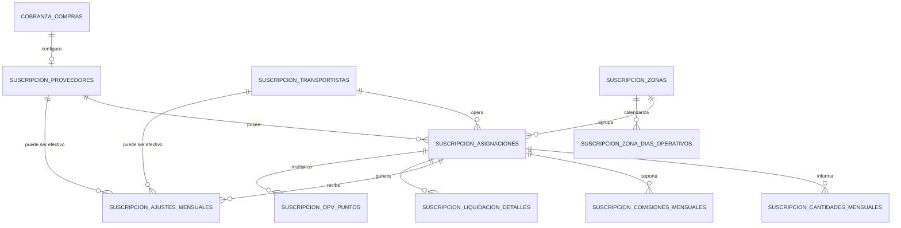

# Modelo de datos del módulo Suscripciones

## 1. Propósito de este documento

Este documento describe el modelo de datos funcional y técnico del módulo
**Suscripciones**.

Su objetivo es permitir que una persona desarrolladora o un agente como Codex
pueda:

- comprender qué representa cada tabla;
- identificar relaciones entre entidades;
- reconocer claves primarias, claves foráneas y claves lógicas;
- distinguir datos maestros, datos mensuales, datos técnicos e históricos;
- detectar inconsistencias entre modelos Eloquent, migraciones y base real;
- evaluar riesgos de duplicidad, nulabilidad, borrado y pérdida de trazabilidad;
- diseñar pruebas de integridad sin depender de una lista cerrada de casos;
- evitar asumir que nombres de columnas o códigos representan identidades
  globales.

Este documento se basa en la arquitectura y el comportamiento confirmado del
módulo. Cuando un campo o restricción no está confirmado, se marca como punto a
verificar.

La fuente final de verdad debe ser contrastada con:

1. migraciones;
2. modelos Eloquent;
3. consultas y servicios vigentes;
4. esquema real de la base de datos;
5. datos históricos existentes.

---

## 2. Principios del modelo

### 2.1. La asignación es la entidad central

La tabla:

```text
suscripcion_asignaciones
```

es el catálogo central del módulo.

Representa tanto líneas operativas como líneas técnicas.

Cada detalle mensual, cantidad variable, ajuste, pago adicional u OPV debe
mantener una relación con una asignación.

### 2.2. La identidad histórica es el ID de asignación

El campo `codigo` no debe tratarse como identificador único global.

Pueden existir códigos repetidos entre:

- proveedores;
- transportistas;
- zonas;
- puntos;
- servicios;
- tipos de asignación;
- períodos históricos.

La identidad estable para trazabilidad es:

```text
suscripcion_asignacion_id
```

### 2.3. La zona pertenece a la asignación

La relación correcta es:

```text
suscripcion_asignaciones.suscripcion_zona_id
→ suscripcion_zonas.id
```

No debe modelarse una zona directamente sobre el proveedor.

Un proveedor puede operar en varias zonas y una zona puede contener
asignaciones de varios proveedores.

### 2.4. El detalle mensual es un hecho histórico

La tabla:

```text
suscripcion_liquidacion_detalles
```

representa el resultado calculado para una asignación en un año y mes.

El detalle no es solamente una vista temporal. Es la base de:

- revisión mensual;
- consolidación;
- tributación;
- pre-factura;
- PDF;
- ZIP;
- correo;
- OneDrive.

### 2.5. Los ajustes son datos mensuales separados

Los ajustes no deben sobrescribir silenciosamente el catálogo maestro.

Un cambio de proveedor, transportista, documento, cantidad o costo para un
período debe conservar trazabilidad mensual.

### 2.6. Existen asignaciones técnicas

Los tipos:

```text
COMISION
CONTENEDOR_AJUSTE
```

pueden existir para soportar pagos adicionales o novedades.

No representan necesariamente una ruta física.

### 2.7. La base debe reforzar las invariantes

Las validaciones PHP son necesarias, pero no suficientes.

Codex debe verificar que las invariantes importantes también estén protegidas
mediante:

- índices únicos;
- claves foráneas;
- nulabilidad;
- tipos correctos;
- precisión decimal;
- restricciones de borrado;
- transacciones.

---

## 3. Clasificación de tablas

### 3.1. Catálogos maestros

```text
cobranza_compras
suscripcion_proveedores
suscripcion_transportistas
suscripcion_zonas
suscripcion_asignaciones
suscripcion_conceptos_pago_variable
suscripcion_opv_puntos
```

### 3.2. Datos mensuales de entrada

```text
suscripcion_zona_dias_operativos
suscripcion_cantidades_mensuales
suscripcion_comisiones_mensuales
suscripcion_ajustes_mensuales
```

### 3.3. Datos mensuales calculados

```text
suscripcion_liquidacion_detalles
```

### 3.4. Tablas externas o compartidas

```text
cobranza_compras
```

puede ser utilizada por otros módulos además de Suscripciones.

Por ello, los cambios en esta tabla tienen impacto transversal.

---

## 4. Diagrama entidad-relación conceptual



Este diagrama es conceptual. Codex debe confirmar las claves foráneas reales y
la dirección exacta de cada relación Eloquent.

---

# 5. Tabla `cobranza_compras`

## 5.1. Propósito

Entidad comercial compartida que contiene información general de la persona o
empresa utilizada como proveedor.

En Suscripciones aporta datos como:

- razón social;
- RUT;
- dirección;
- comuna;
- datos bancarios;
- banco;
- tipo de cuenta;
- número de cuenta;
- otros datos de contacto o pago.

## 5.2. Relación con Suscripciones

Relación conceptual:

```text
CobranzaCompra
→ hasOne o hasMany SuscripcionProveedor
```

y:

```text
SuscripcionProveedor
→ belongsTo CobranzaCompra
```

La cardinalidad exacta debe verificarse en el modelo y en el esquema.

## 5.3. Campos relevantes conocidos

```text
id
razon_social
rut
direccion
comuna
datos bancarios
```

Los nombres exactos de banco, tipo de cuenta, número de cuenta y correo deben
verificarse.

## 5.4. Reglas de integridad

- El RUT debe tratarse como dato de identidad comercial, no necesariamente como
  clave primaria.
- Debe confirmarse si el RUT posee índice único.
- Debe confirmarse si el formato se guarda normalizado o con puntos y guion.
- La razón social puede cambiar, pero los documentos históricos deben conservar
  coherencia.
- No debe asumirse que todos los registros de `cobranza_compras` pertenecen al
  módulo Suscripciones.

## 5.5. Riesgos

- duplicidad de RUT con formatos distintos;
- datos bancarios incompletos;
- proveedor eliminado o desactivado con asignaciones históricas;
- cambios maestros que alteren la presentación de documentos históricos;
- dependencia de tablas de banco o tipo de cuenta externas.

---

# 6. Tabla `suscripcion_proveedores`

## 6.1. Propósito

Configura a una entidad de `cobranza_compras` para operar dentro del módulo
Suscripciones.

Aporta información específica del proceso de pre-factura, como:

- tipo documental;
- correo;
- etiquetas tributarias;
- textos de documento;
- estado;
- otros parámetros del módulo.

## 6.2. Modelo esperado

```php
App\Models\SuscripcionProveedor
```

## 6.3. Relaciones conceptuales

```text
belongsTo CobranzaCompra
hasMany Asignaciones
```

Puede ser referenciado como proveedor efectivo desde ajustes mensuales.

## 6.4. Campos relevantes conocidos o inferidos por uso

```text
id
cobranza_compra_id
tipo_documento
correo
detalle_documento
detalle_impuesto
final
activo
timestamps
```

Los nombres exactos, nulabilidad y tipos deben verificarse.

## 6.5. Tipo documental

Valores funcionales conocidos:

```text
FACTURA
BOLETA
DOCUMENTO
```

Codex debe revisar:

- si los valores están restringidos en base de datos;
- si existen variantes históricas;
- si se guardan en mayúsculas;
- si puede ser nulo;
- si un ajuste mensual puede reemplazarlo.

## 6.6. Reglas de integridad

- `cobranza_compra_id` debe referenciar un registro existente.
- El tipo documental debe pertenecer al conjunto aceptado.
- El correo puede ser requerido para envío real, aunque no necesariamente para
  generación.
- No debe eliminarse un proveedor con asignaciones o detalles históricos sin
  una política explícita.
- Los datos tributarios usados en documentos deben resolverse desde una única
  fuente coherente.

## 6.7. Riesgos

- proveedor activo sin correo;
- tipo documental nulo o no reconocido;
- textos tributarios incompletos;
- dos configuraciones de Suscripciones para una misma entidad comercial;
- cambios maestros que alteren documentos históricos;
- proveedor efectivo mensual distinto al proveedor base.

---

# 7. Tabla `suscripcion_transportistas`

## 7.1. Propósito

Catálogo de transportistas utilizados por las asignaciones.

## 7.2. Modelo esperado

```php
App\Models\SuscripcionTransportista
```

## 7.3. Relaciones conceptuales

```text
hasMany Asignaciones
```

Puede también aparecer como transportista efectivo en ajustes mensuales.

## 7.4. Campos relevantes

Los nombres exactos deben verificarse. Funcionalmente se espera:

```text
id
nombre o razón social
rut u otro identificador
activo
timestamps
```

## 7.5. Reglas de integridad

- Una asignación puede necesitar transportista.
- Debe confirmarse si la relación es obligatoria o nullable.
- Un transportista histórico no debería borrarse físicamente si existen
  detalles asociados.
- Debe confirmarse si existe un estado activo y cómo afecta catálogos y
  generación.

## 7.6. Riesgos

- asignaciones sin transportista;
- duplicidad de transportista;
- cambios de nombre sin trazabilidad;
- ajustes con transportista efectivo no resueltos en todas las salidas.

---

# 8. Tabla `suscripcion_zonas`

## 8.1. Propósito

Catálogo de zonas operativas de distribución.

## 8.2. Modelo

```php
App\Models\SuscripcionZona
```

## 8.3. Estructura confirmada

```text
id
numero_zona
despacho
activo
created_at
updated_at
```

## 8.4. Tipos y restricciones confirmadas

```text
id                 PK
numero_zona        unsigned small integer
despacho           varchar(150)
activo             boolean, default true
timestamps
```

Restricciones:

```text
UNIQUE(numero_zona)
INDEX(activo)
```

## 8.5. Relaciones

```text
hasMany Asignaciones
hasMany SuscripcionZonaDiaOperativo
```

## 8.6. Catálogo inicial confirmado

| Número | Despacho |
|---:|---|
| 1 | Vitacura |
| 2 | Lo Barnechea |
| 3 | Las Condes |
| 4 | Providencia |
| 5 | La Reina |
| 6 | Ñuñoa |
| 7 | Peñalolén |
| 8 | Plaza Oeste 5 |
| 9 | Centro |
| 10 | San Miguel |
| 11 | Macul |
| 12 | Bellavista 1 |
| 13 | Plaza Oeste 2 |
| 14 | Plaza Oeste 1 |
| 15 | Bellavista 2 |
| 16 | Plaza Oeste 3 |
| 17 | Plaza Oeste 4 |

Este catálogo es una referencia inicial, no una garantía de que siempre existan
exactamente 17 zonas activas.

## 8.7. Reglas de integridad

- `numero_zona` debe ser único.
- `despacho` debe ser legible y no vacío.
- La desactivación no debe borrar calendarios ni asignaciones históricas.
- Una zona con asignaciones activas no debería eliminarse físicamente.
- La generación usa solamente zonas activas para construir la matriz enviada
  desde el formulario.
- Las asignaciones históricas pueden seguir apuntando a una zona inactiva.

## 8.8. Política de borrado confirmada

La relación desde asignaciones y calendario utiliza:

```text
restrictOnDelete()
```

Esto impide eliminar una zona referenciada.

## 8.9. Riesgos

- renumeración de zonas;
- duplicidad de nombre con número distinto;
- zona desactivada todavía usada por una asignación automática;
- asignación sin zona;
- discrepancia entre zonas activas del formulario y zonas utilizadas por
  asignaciones.

---

# 9. Tabla `suscripcion_asignaciones`

## 9.1. Propósito

Catálogo central de líneas operativas y técnicas.

Una asignación puede representar:

- ruta;
- pago fijo mensual;
- cantidad variable;
- comisión o pago adicional;
- contenedor técnico para ajustes;
- OPV almacenada como ruta.

## 9.2. Modelo

```php
App\Models\Asignaciones
```

El nombre singular o plural de la clase es histórico. La tabla es:

```text
suscripcion_asignaciones
```

## 9.3. Campos relevantes confirmados por uso

```text
id
suscripcion_proveedor_id
suscripcion_transportista_id
suscripcion_zona_id
punto_1
punto_2 o campos de punto adicionales
origen_gasto
codigo
servicio
costo
grupo_prefactura
generar_automaticamente
tipo_asignacion
created_at
updated_at
```

Los nombres exactos de todos los campos de punto deben verificarse.

## 9.4. Relación con zona

Campo confirmado:

```text
suscripcion_zona_id nullable
```

Clave foránea:

```text
suscripcion_zona_id
→ suscripcion_zonas.id
```

Política:

```text
restrictOnDelete()
```

La nulabilidad es necesaria para asignaciones que no dependen de calendario,
por ejemplo:

```text
COMISION
CONTENEDOR_AJUSTE
VARIABLE
```

La obligatoriedad funcional depende del tipo de asignación.

## 9.5. Relaciones Eloquent esperadas

```text
belongsTo SuscripcionProveedor
belongsTo SuscripcionTransportista
belongsTo SuscripcionZona
hasMany SuscripcionLiquidacionDetalle
hasMany SuscripcionCantidadMensual
hasMany SuscripcionComisionMensual
hasMany SuscripcionAjusteMensual
hasMany SuscripcionOPVPuntos
```

Codex debe confirmar cuáles están implementadas y con qué nombres.

## 9.6. Tipos de asignación confirmados

```text
RUTA
FIJO_MENSUAL
VARIABLE
COMISION
CONTENEDOR_AJUSTE
```

OPV puede estar almacenada como `RUTA`.

## 9.7. Campo `generar_automaticamente`

Comportamiento conocido:

- nulo o igual a 1: elegible para generación automática;
- 0: no generar automáticamente.

Debe verificarse:

- tipo SQL;
- valor por defecto;
- nulabilidad;
- cast boolean;
- existencia de registros con valores distintos de 0, 1 o null.

## 9.8. Campo `codigo`

No es identidad global.

Puede repetirse.

Nunca debe utilizarse como único criterio para:

- actualizar historial;
- aplicar ajustes;
- buscar duplicados;
- consolidar pre-facturas;
- borrar registros;
- resolver zona;
- resolver proveedor.

## 9.9. Campo `grupo_prefactura`

Separa documentos de un mismo proveedor y período.

Debe verificarse:

- nulabilidad;
- longitud;
- normalización;
- tratamiento de cadena vacía;
- mayúsculas y minúsculas;
- espacios;
- si puede ser modificado por ajuste.

## 9.10. Campo `costo`

Debe verificarse:

- tipo decimal;
- precisión;
- escala;
- si admite negativos;
- si se guarda neto o bruto;
- si el detalle mensual copia el valor como instantánea.

No debería utilizarse `float` para dinero.

## 9.11. Reglas por tipo

### `RUTA`

Normalmente requiere:

```text
suscripcion_zona_id no nulo
costo definido
generación automática habilitada
```

### `FIJO_MENSUAL`

No depende del calendario zonal para cantidad.

Cantidad esperada:

```text
1
```

Puede tener zona por datos históricos, pero la generación no debe depender de
ella.

### `VARIABLE`

La cantidad se informa en una tabla mensual.

No debe generarse automáticamente desde fines de semana.

### `COMISION`

Asignación técnica para pagos adicionales.

No debe generarse como ruta automática.

### `CONTENEDOR_AJUSTE`

Asignación técnica para líneas creadas por ajustes.

No debe generarse como ruta automática.

### OPV

Puede estar representada por una asignación `RUTA`.

Su identificación se apoya en código, servicio, origen u otros atributos.

Requiere puntos OPV para ser generada.

## 9.12. Reglas de integridad

- Toda asignación debe tener proveedor válido.
- La relación con transportista debe confirmarse como obligatoria o nullable.
- Toda ruta automática calendarizada debe tener zona.
- Todo costo debe usar precisión monetaria segura.
- Los tipos técnicos deben quedar fuera de la selección automática.
- La desactivación o borrado debe conservar historial.
- El código no debe ser único salvo que exista una regla compuesta más amplia.
- Debe verificarse si existe un campo `activo`.

## 9.13. Datos técnicos versus operativos

Operativos:

```text
RUTA
FIJO_MENSUAL
VARIABLE
OPV
```

Técnicos:

```text
COMISION
CONTENEDOR_AJUSTE
```

Codex debe evitar aplicar las mismas validaciones a ambos grupos.

## 9.14. Snapshot de referencia

En una revisión previa se observaron:

```text
429 asignaciones
257 COMISION
165 RUTA
4 FIJO_MENSUAL
2 CONTENEDOR_AJUSTE
1 VARIABLE
```

Este snapshot es histórico y no debe convertirse en una invariante.

## 9.15. Riesgos

- tipo no reconocido;
- asignación automática sin zona;
- OPV sin puntos;
- costo nulo o negativo;
- grupo de pre-factura inconsistente;
- códigos repetidos usados incorrectamente como clave;
- asignaciones técnicas incluidas por error en generación;
- rutas activas con proveedor o transportista inactivo;
- cambios maestros que alteren comportamiento histórico.

---

# 10. Tabla `suscripcion_zona_dias_operativos`

## 10.1. Propósito

Registrar explícitamente si una zona tuvo despacho en una fecha de sábado o
domingo del período.

## 10.2. Modelo

```php
App\Models\SuscripcionZonaDiaOperativo
```

## 10.3. Estructura confirmada

```text
id
suscripcion_zona_id
fecha
hubo_despacho
observacion
created_at
updated_at
```

## 10.4. Tipos confirmados

```text
suscripcion_zona_id   FK
fecha                  date
hubo_despacho          boolean, default true
observacion            varchar(500), nullable
timestamps
```

## 10.5. Restricciones confirmadas

```text
UNIQUE(suscripcion_zona_id, fecha)
INDEX(fecha)
FOREIGN KEY suscripcion_zona_id
    REFERENCES suscripcion_zonas(id)
    RESTRICT ON DELETE
```

## 10.6. Semántica

```text
hubo_despacho = 1
```

significa que la zona operó ese día.

```text
hubo_despacho = 0
```

significa que toda la zona no tuvo despacho ese día.

No significa que una ruta individual faltó.

## 10.7. Relación Eloquent

```text
belongsTo SuscripcionZona
```

## 10.8. Clave lógica

```text
suscripcion_zona_id + fecha
```

Esta combinación debe ser única tanto en validación como en base.

## 10.9. Regla de matriz completa

Para un período:

```text
zonas activas × fechas sábado/domingo
```

debe existir una fila por cada combinación esperada.

El servicio de generación valida la completitud para las zonas utilizadas.

## 10.10. Datos no operativos

Las fechas de lunes a viernes no forman parte del calendario actual.

Codex debe informar antes de ampliar esta regla a otros días.

## 10.11. Snapshot validado

Julio de 2026:

```text
17 zonas
8 fechas de sábado/domingo
136 registros
```

Zona 2:

```text
6 con despacho
2 sin despacho
```

Resto:

```text
8 con despacho
0 sin despacho
```

Este caso confirma comportamiento, no tamaño fijo de la tabla.

## 10.12. Riesgos

- matriz incompleta;
- fila duplicada;
- fecha fuera del período;
- fecha que no es sábado ni domingo;
- zona inactiva enviada desde cliente;
- cambio de período sin regenerar matriz;
- actualización del calendario después de generar detalles;
- observaciones perdidas por `updateOrCreate`;
- diferencias de zona horaria si se manipula `fecha` como timestamp.

---

# 11. Tabla `suscripcion_cantidades_mensuales`

## 11.1. Propósito

Almacenar la cantidad informada para una asignación `VARIABLE` en un período.

## 11.2. Modelo

```php
App\Models\SuscripcionCantidadMensual
```

## 11.3. Campos funcionales conocidos

```text
id
suscripcion_asignacion_id
anio
mes
cantidad
costo
total
observacion
created_at
updated_at
```

Los nombres exactos deben verificarse.

## 11.4. Clave lógica esperada

```text
suscripcion_asignacion_id + anio + mes
```

Debe verificarse si la tabla permite una sola cantidad por asignación y período
o varias entradas independientes.

El comportamiento actual sugiere una entrada mensual por asignación.

## 11.5. Relaciones

```text
belongsTo Asignaciones
```

## 11.6. Reglas de integridad

- la asignación debe ser de tipo `VARIABLE`;
- año y mes deben ser válidos;
- cantidad debe ser numérica;
- costo y total deben usar decimal;
- total debe coincidir con la regla vigente;
- debe evitarse duplicidad para la misma asignación y período;
- una cantidad mensual no depende del calendario zonal.

## 11.7. Riesgos

- duplicidad sin índice único;
- asignación no variable;
- cantidad negativa;
- costo distinto al esperado;
- total enviado por cliente sin recalcular;
- registro mensual existente que provoca fallo al reintentar;
- borrado de la asignación base.

---

# 12. Tabla `suscripcion_comisiones_mensuales`

## 12.1. Propósito

Almacenar pagos adicionales independientes de un período.

Aunque el nombre histórico use “comisión”, funcionalmente puede representar un
pago adicional con:

- tarifa;
- cantidad;
- observación;
- proveedor;
- transportista;
- asignación técnica.

## 12.2. Modelo

```php
App\Models\SuscripcionComisionMensual
```

## 12.3. Campos funcionales conocidos

```text
id
suscripcion_asignacion_id
suscripcion_proveedor_id
suscripcion_transportista_id
anio
mes
tarifa
cantidad
total
observacion
created_at
updated_at
```

Los campos exactos deben verificarse.

## 12.4. Relación con asignación técnica

Cada pago adicional utiliza una asignación de tipo:

```text
COMISION
```

La asignación técnica debe tener:

```text
suscripcion_zona_id = null
generar_automaticamente = 0
```

o una configuración equivalente que impida su generación automática.

## 12.5. Independencia de pagos

Dos pagos adicionales pueden tener los mismos valores y aun así representar
operaciones distintas.

Por ello, no debe imponerse una unicidad basada solamente en:

```text
proveedor + período + tarifa + cantidad
```

La identidad debe conservar el registro individual.

## 12.6. Generación hacia detalles

El servicio mensual crea un detalle por pago adicional, usando la asignación
técnica asociada.

Debe verificarse cómo evita duplicar detalles cuando dos pagos usan la misma
asignación técnica.

Este punto es especialmente importante: si la identidad del detalle es
solamente:

```text
suscripcion_asignacion_id + anio + mes
```

entonces dos pagos independientes no pueden compartir la misma asignación
técnica sin colisionar.

Codex debe inspeccionar el modelo real, la creación de asignaciones técnicas y
la clave usada por el generador.

## 12.7. Reglas de integridad

- tarifa y cantidad deben ser numéricas;
- total debe recalcularse en backend;
- cada pago debe conservar observación;
- no depende del calendario zonal;
- no debe mezclarse con la cantidad variable;
- la asignación asociada debe ser técnica;
- debe preservarse la independencia entre registros.

## 12.8. Riesgos

- reutilización incorrecta de una asignación técnica;
- colisión de detalle mensual;
- duplicación al reintentar;
- pérdida de observación;
- total calculado en cliente;
- tarifa negativa o cero no validada;
- proveedor efectivo distinto al almacenado.

---

# 13. Tabla `suscripcion_ajustes_mensuales`

## 13.1. Propósito

Persistir novedades o ajustes aplicables a una asignación y período.

## 13.2. Modelo

```php
App\Models\SuscripcionAjusteMensual
```

## 13.3. Tipos funcionales conocidos

```text
INASISTENCIA
FACTURACION
LINEA_ADICIONAL
PAGO_VARIABLE
PAGO_ADICIONAL
REEMPLAZO
```

Los valores exactos instalados deben verificarse en:

- validadores;
- servicios;
- migraciones;
- datos históricos.

## 13.4. Campos funcionales esperados

Según tipo de ajuste, la tabla puede contener:

```text
id
suscripcion_asignacion_id
anio
mes
tipo_ajuste
q_calendario
q_inasistencia
cantidad
costo
total
suscripcion_proveedor_id efectivo
suscripcion_transportista_id efectivo
tipo_documento efectivo
codigo
servicio
punto
origen
grupo_prefactura
observacion
created_at
updated_at
```

No todos estos campos están confirmados con sus nombres exactos.

## 13.5. Relación principal

```text
belongsTo Asignaciones
```

Puede referenciar:

- una asignación operativa existente;
- una asignación técnica `CONTENEDOR_AJUSTE`.

## 13.6. Ajuste de inasistencia

Debe afectar:

```text
q_inasistencia
```

y preservar:

```text
q_calendario
```

salvo que una regla explícita indique lo contrario.

## 13.7. Ajuste de facturación

Puede cambiar para un período:

- proveedor efectivo;
- transportista efectivo;
- tipo documental;
- otros datos usados para consolidación.

No debe modificar necesariamente el proveedor base de la asignación.

## 13.8. Líneas adicionales

Pueden crear detalles nuevos usando una asignación técnica.

Deben conservar:

- concepto;
- costo;
- cantidad;
- total;
- proveedor efectivo;
- grupo;
- observación.

## 13.9. Reemplazo

Puede sustituir proveedor o transportista operativo para un período.

La semántica exacta debe verificarse en el servicio de registro y aplicación.

## 13.10. Clave lógica

La tabla puede tener una restricción única compuesta.

Codex debe verificar si incluye:

```text
suscripcion_asignacion_id
anio
mes
tipo_ajuste
```

o una variante.

Existe riesgo si la restricción no incluye `tipo_ajuste`, porque distintos
ajustes del mismo período podrían colisionar.

## 13.11. Reglas de integridad

- el tipo debe ser reconocido;
- los campos obligatorios dependen del tipo;
- una inasistencia debe apuntar a una asignación válida;
- una línea adicional puede necesitar asignación técnica;
- los IDs efectivos deben referenciar registros existentes;
- no debe aceptarse un `q_calendario` que contradiga el calendario zonal sin
  una regla explícita;
- costos y totales deben usar decimal;
- debe preservarse trazabilidad por período.

## 13.12. Riesgos

- restricción única demasiado amplia o demasiado estrecha;
- múltiples ajustes incompatibles para la misma asignación;
- ajuste aplicado dos veces;
- ajuste registrado pero no aplicado;
- proveedor efectivo resuelto en una salida y omitido en otra;
- cambio de documento sin recalcular tributación;
- inasistencia que sobrescribe calendario zonal;
- asignación técnica compartida incorrectamente.

---

# 14. Tabla `suscripcion_liquidacion_detalles`

## 14.1. Propósito

Almacenar el resultado mensual calculado por asignación.

Es la tabla principal para consolidación y pre-facturación.

## 14.2. Modelo

```php
App\Models\SuscripcionLiquidacionDetalle
```

## 14.3. Campos centrales confirmados por uso

```text
id
suscripcion_asignacion_id
anio
mes
codigo
costo
q_calendario
q_inasistencia
cantidad
total
created_at
updated_at
```

Pueden existir otros campos de instantánea. Deben verificarse.

## 14.4. Clave lógica de generación

```text
suscripcion_asignacion_id + anio + mes
```

El servicio consulta esta combinación para evitar duplicados.

Debe verificarse si existe también:

```text
UNIQUE(suscripcion_asignacion_id, anio, mes)
```

en base de datos.

Si no existe, dos procesos concurrentes podrían insertar duplicados a pesar de
la consulta previa.

## 14.5. Relación

```text
belongsTo Asignaciones
```

## 14.6. Semántica de cantidades

### Ruta normal

```text
cantidad = max(0, q_calendario - q_inasistencia)
```

### OPV

```text
cantidad =
max(0, q_calendario - q_inasistencia)
× puntos_opv
```

### Fijo mensual

```text
q_calendario = 1
q_inasistencia = 0
cantidad = 1
```

### Variable

La cantidad proviene del registro mensual.

### Pago adicional

La cantidad proviene del pago mensual.

## 14.7. Campo `codigo`

Puede copiarse desde la asignación como instantánea.

No debe usarse para enlazar historial.

## 14.8. Campo `costo`

Debe representar el costo usado para ese período.

Debe verificarse si:

- se copia siempre desde la asignación;
- puede ser reemplazado por un ajuste;
- se guarda como decimal;
- puede diferir del costo maestro actual.

## 14.9. Campo `total`

Debe ser coherente con:

```text
costo × cantidad
```

salvo que exista una regla especial documentada.

No debe confiarse en un total enviado por navegador.

## 14.10. Datos históricos

Modificar la asignación maestra después de generar no debería alterar
automáticamente un detalle histórico ya persistido.

Codex debe identificar si las vistas usan:

- campos del detalle;
- campos actuales de la asignación;
- una combinación de ambos.

El uso de datos maestros actuales puede cambiar la representación histórica.

## 14.11. Snapshot de referencia

En una revisión previa se observaron:

```text
596 detalles
abril: 236
mayo: 171
junio: 189
```

Este snapshot es histórico y no debe tratarse como invariante.

## 14.12. Riesgos

- ausencia de índice único;
- duplicados por concurrencia;
- recálculo parcial;
- costo histórico leído desde maestro;
- cantidad negativa;
- total inconsistente;
- detalle huérfano;
- código usado como relación;
- mezcla de proveedor base y efectivo;
- detalle existente que no se actualiza al cambiar calendario.

---

# 15. Tabla `suscripcion_opv_puntos`

## 15.1. Propósito

Registrar puntos o locales asociados a una asignación OPV.

## 15.2. Modelo

```php
App\Models\SuscripcionOPVPuntos
```

## 15.3. Relación

```text
belongsTo Asignaciones
```

La asignación puede tener múltiples puntos.

## 15.4. Uso en cálculo

El número de puntos determina el multiplicador:

```text
cantidad =
días efectivos × cantidad de puntos
```

## 15.5. Campos esperados

```text
id
suscripcion_asignacion_id
punto o descripción
activo
created_at
updated_at
```

Los nombres exactos deben verificarse.

## 15.6. Reglas de integridad

- el punto debe pertenecer a una asignación OPV;
- no debe contarse un punto inactivo;
- no debe duplicarse el mismo punto si la regla lo prohíbe;
- una OPV sin puntos no se genera;
- la cantidad de puntos usada debe ser consistente entre generación y ajustes.

## 15.7. Riesgos

- puntos duplicados;
- puntos inactivos contados;
- OPV detectada incorrectamente;
- cambio de puntos después de generar un período;
- diferencia entre `count()` de relación y filtro por activos;
- eliminación física de puntos que altera auditoría histórica.

---

# 16. Tabla `suscripcion_conceptos_pago_variable`

## 16.1. Propósito

Catálogo de conceptos utilizados en pagos variables, líneas adicionales u otras
novedades.

## 16.2. Modelo

```php
App\Models\SuscripcionConceptoPagoVariable
```

## 16.3. Campos conocidos conceptualmente

```text
id
nombre o concepto
activo
orden
created_at
updated_at
```

Los nombres exactos deben verificarse.

## 16.4. Reglas de integridad

- solo conceptos activos deben mostrarse para nuevas operaciones;
- conceptos históricos no deberían eliminarse físicamente;
- el orden debe ser estable;
- el concepto seleccionado debe guardarse de forma trazable en el ajuste o
  detalle.

## 16.5. Riesgos

- concepto eliminado con historial;
- nombre cambiado que altera documentos anteriores;
- concepto inactivo aún enviado desde cliente;
- duplicidad de nombre;
- orden nulo o duplicado.

---

# 17. Relaciones resumidas

| Tabla origen | Relación | Tabla destino | Cardinalidad conceptual |
|---|---|---|---|
| `suscripcion_proveedores` | `cobranza_compra_id` | `cobranza_compras` | N:1 o 1:1 |
| `suscripcion_asignaciones` | `suscripcion_proveedor_id` | `suscripcion_proveedores` | N:1 |
| `suscripcion_asignaciones` | `suscripcion_transportista_id` | `suscripcion_transportistas` | N:1 |
| `suscripcion_asignaciones` | `suscripcion_zona_id` | `suscripcion_zonas` | N:1 nullable |
| `suscripcion_zona_dias_operativos` | `suscripcion_zona_id` | `suscripcion_zonas` | N:1 |
| `suscripcion_cantidades_mensuales` | `suscripcion_asignacion_id` | `suscripcion_asignaciones` | N:1 |
| `suscripcion_comisiones_mensuales` | `suscripcion_asignacion_id` | `suscripcion_asignaciones` | N:1 |
| `suscripcion_ajustes_mensuales` | `suscripcion_asignacion_id` | `suscripcion_asignaciones` | N:1 |
| `suscripcion_liquidacion_detalles` | `suscripcion_asignacion_id` | `suscripcion_asignaciones` | N:1 |
| `suscripcion_opv_puntos` | `suscripcion_asignacion_id` | `suscripcion_asignaciones` | N:1 |

Codex debe completar esta tabla con nombres exactos de constraints e índices.

---

# 18. Claves lógicas e índices esperados

## 18.1. Confirmados

### Zonas

```text
UNIQUE(numero_zona)
```

### Calendario zonal

```text
UNIQUE(suscripcion_zona_id, fecha)
INDEX(fecha)
```

## 18.2. Esperados y pendientes de confirmar

### Detalles mensuales

```text
UNIQUE(suscripcion_asignacion_id, anio, mes)
```

### Cantidades mensuales

```text
UNIQUE(suscripcion_asignacion_id, anio, mes)
```

### Ajustes mensuales

La clave depende del tipo de ajuste y debe inspeccionarse.

### OPV puntos

Puede requerir una unicidad por:

```text
suscripcion_asignacion_id + punto
```

### Proveedores

Puede requerir unicidad por:

```text
cobranza_compra_id
```

si la relación es uno a uno.

## 18.3. Advertencia de concurrencia

Una consulta previa con `exists()` no sustituye un índice único.

Dos solicitudes concurrentes pueden:

1. consultar que no existe;
2. insertar ambas;
3. crear duplicados.

Las claves críticas deben reforzarse en SQL.

---

# 19. Nulabilidad funcional

## 19.1. Campos que pueden ser nulos legítimamente

```text
suscripcion_asignaciones.suscripcion_zona_id
```

para asignaciones no calendarizadas.

```text
suscripcion_zona_dias_operativos.observacion
```

cuando no existe comentario.

Otros campos de ajustes pueden ser nulos dependiendo del tipo.

## 19.2. Campos que no deberían ser nulos funcionalmente

Sin afirmar la restricción SQL exacta, deberían existir para operaciones
válidas:

```text
suscripcion_asignaciones.suscripcion_proveedor_id
suscripcion_asignaciones.tipo_asignacion
suscripcion_zona_dias_operativos.suscripcion_zona_id
suscripcion_zona_dias_operativos.fecha
suscripcion_zona_dias_operativos.hubo_despacho
suscripcion_liquidacion_detalles.suscripcion_asignacion_id
suscripcion_liquidacion_detalles.anio
suscripcion_liquidacion_detalles.mes
```

Codex debe comparar estas expectativas con la base real.

---

# 20. Tipos de datos monetarios

Los campos monetarios incluyen, según tabla:

```text
costo
tarifa
total
impuesto
retención
líquido
```

Deben almacenarse con:

```text
DECIMAL
```

y no con:

```text
FLOAT
DOUBLE
```

salvo decisión explícita y justificada.

Codex debe verificar:

- precisión;
- escala;
- redondeo;
- uso de enteros en pesos;
- cast Eloquent;
- operaciones PHP;
- consistencia entre base, PDF y resumen.

Los cálculos tributarios deben aplicar la misma política de redondeo en todas
las salidas.

---

# 21. Tipos de datos de período

El período se representa mediante:

```text
anio
mes
```

y no mediante una única fecha mensual.

Reglas esperadas:

```text
anio: entero válido
mes: entero entre 1 y 12
```

Codex debe revisar:

- tamaño SQL;
- validaciones;
- índices;
- valores históricos fuera de rango;
- ceros;
- strings;
- zona horaria.

---

# 22. Estados y borrado lógico

Varias tablas pueden usar:

```text
activo
```

No se ha confirmado uso de `SoftDeletes`.

Codex debe verificar por modelo:

```php
use SoftDeletes;
```

y por tabla:

```text
deleted_at
```

Cuando no exista borrado lógico, debe evitarse eliminar físicamente catálogos
con historial.

Especial cuidado con:

- proveedores;
- transportistas;
- zonas;
- asignaciones;
- conceptos;
- puntos OPV.

---

# 23. Integridad histórica

## 23.1. Catálogo versus instantánea

Codex debe determinar qué atributos se copian al detalle y cuáles se consultan
desde el catálogo actual.

Atributos sensibles:

```text
codigo
servicio
punto
origen
costo
proveedor
transportista
grupo_prefactura
tipo_documento
datos bancarios
```

## 23.2. Cambio maestro posterior

Un cambio en el catálogo puede alterar documentos históricos si la vista lee
directamente la relación actual.

Esto puede ser correcto o incorrecto según la regla funcional.

No debe “corregirse” sin confirmación.

## 23.3. Ajustes mensuales

Los ajustes funcionan como una capa temporal.

El proveedor efectivo, transportista efectivo o documento efectivo puede ser
distinto del maestro solo en un período.

---

# 24. Matriz de generación por tipo de asignación

| Tipo | Fuente de cantidad | Requiere zona | Requiere puntos | Se genera automáticamente |
|---|---|---:|---:|---:|
| `RUTA` normal | días zonales menos inasistencias | Sí | No | Sí, si está habilitada |
| OPV almacenada como `RUTA` | días efectivos × puntos | Sí | Sí | Sí, si tiene puntos |
| `FIJO_MENSUAL` | 1 | No | No | Sí |
| `VARIABLE` | cantidad mensual informada | No | No | Desde tabla mensual |
| `COMISION` | tarifa y cantidad mensual | No | No | Desde pago adicional |
| `CONTENEDOR_AJUSTE` | ajuste explícito | No | No | No como base |

---

# 25. Matriz de dependencia por tabla

| Tabla | Catálogo | Entrada mensual | Resultado | Técnica | Histórica |
|---|---:|---:|---:|---:|---:|
| `cobranza_compras` | Sí | No | No | No | Sí |
| `suscripcion_proveedores` | Sí | No | No | No | Sí |
| `suscripcion_transportistas` | Sí | No | No | No | Sí |
| `suscripcion_zonas` | Sí | No | No | No | Sí |
| `suscripcion_asignaciones` | Sí | No | No | Parcial | Sí |
| `suscripcion_zona_dias_operativos` | No | Sí | No | No | Sí |
| `suscripcion_cantidades_mensuales` | No | Sí | No | No | Sí |
| `suscripcion_comisiones_mensuales` | No | Sí | No | Parcial | Sí |
| `suscripcion_ajustes_mensuales` | No | Sí | No | Parcial | Sí |
| `suscripcion_liquidacion_detalles` | No | No | Sí | No | Sí |
| `suscripcion_opv_puntos` | Sí | No | No | No | Sí |
| `suscripcion_conceptos_pago_variable` | Sí | No | No | No | Sí |

---

# 26. Escenarios de inconsistencia que Codex debe buscar

Sin limitar el análisis, el modelo permite investigar al menos:

- detalles sin asignación;
- asignaciones sin proveedor;
- rutas automáticas sin zona;
- zonas utilizadas sin calendario completo;
- fechas duplicadas por zona;
- fechas que no son sábado o domingo;
- cantidades mensuales para asignaciones no variables;
- pagos adicionales vinculados a asignaciones no técnicas;
- ajustes con tipo desconocido;
- ajustes sin detalle base cuando deberían modificar uno;
- detalles duplicados por asignación y período;
- OPV sin puntos;
- puntos OPV en asignaciones que no son OPV;
- costos negativos;
- totales que no coinciden con costo por cantidad;
- cantidades negativas;
- inasistencias mayores que calendario;
- proveedor efectivo inexistente;
- tipo documental no reconocido;
- grupos de pre-factura vacíos tratados de forma distinta;
- registros inactivos todavía usados;
- claves foráneas sin política de borrado segura;
- índices únicos ausentes;
- diferencias entre casts Eloquent y tipos SQL;
- precisión decimal insuficiente;
- datos históricos afectados por cambios maestros;
- asignaciones técnicas incluidas en generación automática;
- dos pagos independientes que colisionan por compartir asignación técnica.

---

# 27. Consultas de diagnóstico no destructivas sugeridas por el modelo

Estas consultas son ejemplos de inspección. Codex puede diseñar otras.

## 27.1. Rutas automáticas sin zona

```sql
SELECT
    id,
    codigo,
    tipo_asignacion,
    generar_automaticamente
FROM suscripcion_asignaciones
WHERE tipo_asignacion = 'RUTA'
  AND COALESCE(generar_automaticamente, 1) = 1
  AND suscripcion_zona_id IS NULL;
```

## 27.2. Duplicados de calendario

```sql
SELECT
    suscripcion_zona_id,
    fecha,
    COUNT(*) AS cantidad
FROM suscripcion_zona_dias_operativos
GROUP BY suscripcion_zona_id, fecha
HAVING COUNT(*) > 1;
```

## 27.3. Duplicados de detalle

```sql
SELECT
    suscripcion_asignacion_id,
    anio,
    mes,
    COUNT(*) AS cantidad
FROM suscripcion_liquidacion_detalles
GROUP BY suscripcion_asignacion_id, anio, mes
HAVING COUNT(*) > 1;
```

## 27.4. Totales inconsistentes

```sql
SELECT
    id,
    costo,
    cantidad,
    total,
    costo * cantidad AS total_calculado
FROM suscripcion_liquidacion_detalles
WHERE total <> costo * cantidad;
```

Esta consulta debe adaptarse a la política real de redondeo.

## 27.5. Inasistencia superior al calendario

```sql
SELECT
    id,
    suscripcion_asignacion_id,
    anio,
    mes,
    q_calendario,
    q_inasistencia
FROM suscripcion_liquidacion_detalles
WHERE q_inasistencia > q_calendario;
```

En OPV, `q_calendario` sigue representando días, no puntos.

## 27.6. Asignaciones técnicas con zona

```sql
SELECT
    id,
    codigo,
    tipo_asignacion,
    suscripcion_zona_id
FROM suscripcion_asignaciones
WHERE tipo_asignacion IN ('COMISION', 'CONTENEDOR_AJUSTE')
  AND suscripcion_zona_id IS NOT NULL;
```

## 27.7. Tipos no reconocidos

```sql
SELECT
    tipo_asignacion,
    COUNT(*) AS cantidad
FROM suscripcion_asignaciones
GROUP BY tipo_asignacion
ORDER BY tipo_asignacion;
```

Las consultas deben ejecutarse solo sobre una conexión segura y no destructiva.

---

# 28. Verificaciones de esquema que Codex debe ejecutar

Codex debe revisar, según el motor:

```sql
SHOW CREATE TABLE suscripcion_asignaciones;
SHOW CREATE TABLE suscripcion_zonas;
SHOW CREATE TABLE suscripcion_zona_dias_operativos;
SHOW CREATE TABLE suscripcion_cantidades_mensuales;
SHOW CREATE TABLE suscripcion_comisiones_mensuales;
SHOW CREATE TABLE suscripcion_ajustes_mensuales;
SHOW CREATE TABLE suscripcion_liquidacion_detalles;
SHOW CREATE TABLE suscripcion_opv_puntos;
```

Debe comparar:

- columnas reales;
- tipos;
- defaults;
- nulabilidad;
- índices;
- claves foráneas;
- políticas `ON DELETE`;
- collations;
- engine.

También debe revisar:

```bash
php artisan migrate:status
```

sin ejecutar migraciones destructivas.

---

# 29. Verificaciones de modelos Eloquent

Por cada modelo, Codex debe revisar:

```text
$table
$fillable
$guarded
$casts
$dates
$hidden
$with
SoftDeletes
relaciones
scopes
accessors
mutators
eventos de modelo
observers
```

Especial atención a:

- casts booleanos;
- casts decimales;
- fechas;
- nombres de claves foráneas;
- relaciones con nombres no estándar;
- `withDefault()`;
- borrados en cascada desde eventos;
- mass assignment.

---

# 30. Reglas para migraciones futuras

Toda migración del módulo debe:

- preservar datos existentes;
- evitar `dropColumn` sin respaldo;
- considerar filas históricas;
- usar claves foráneas compatibles con tipos de ID;
- agregar índices después de limpiar duplicados;
- documentar valores por defecto;
- evitar convertir nullable a not-null sin backfill;
- usar `restrictOnDelete` para catálogos históricos cuando corresponda;
- evitar cascadas destructivas no justificadas;
- probar rollback en base de pruebas;
- separar cambios de estructura de correcciones masivas de datos;
- incluir consulta previa de impacto cuando agregue unicidad.

---

# 31. Estado confirmado del poblamiento zonal

En la incorporación inicial de zonas se actualizaron asignaciones operativas
usando una equivalencia entre `punto_1` y zona.

Resultado confirmado de esa carga:

```text
429 asignaciones totales
170 asignaciones con zona
165 RUTA con zona
4 FIJO_MENSUAL con zona
1 VARIABLE con zona
0 operativas esperadas sin zona
0 COMISION con zona
0 CONTENEDOR_AJUSTE con zona
```

Se creó un respaldo de referencia:

```text
suscripcion_asignaciones_backup_zonas_20260728
```

Este respaldo puede no existir en todos los entornos.

Codex no debe depender de él para pruebas automatizadas.

---

# 32. Diferencia entre invariantes y snapshots

## Invariante

Debe ser cierto siempre:

```text
No puede existir más de una fila de calendario para la misma zona y fecha.
```

## Snapshot

Fue cierto en un momento:

```text
Existían 429 asignaciones.
```

La documentación debe conservar esta distinción para evitar que pruebas
automaticen cantidades históricas como reglas permanentes.

---

# 33. Puntos críticos pendientes de confirmación

Codex debe verificar directamente:

1. índice único de `suscripcion_liquidacion_detalles`;
2. índice único de `suscripcion_cantidades_mensuales`;
3. clave única de `suscripcion_ajustes_mensuales`;
4. estrategia de asignación técnica para múltiples pagos adicionales;
5. precisión decimal de todos los campos monetarios;
6. existencia de `SoftDeletes`;
7. cascadas reales de claves foráneas;
8. cardinalidad entre `cobranza_compras` y `suscripcion_proveedores`;
9. campos exactos de proveedor efectivo en ajustes;
10. si el detalle guarda instantáneas suficientes;
11. cómo se distingue OPV de una ruta normal;
12. si los puntos OPV tienen estado activo;
13. si los conceptos de pago variable se copian al historial;
14. si existe índice por `anio, mes`;
15. si proveedor, transportista o zona pueden estar inactivos;
16. si hay datos huérfanos anteriores a las claves foráneas;
17. diferencias entre esquema de desarrollo y producción.

---

# 34. Regla de mantenimiento

Actualizar este documento cuando:

- se agregue una tabla;
- se agregue un tipo de asignación;
- se agregue un tipo de ajuste;
- cambie una clave lógica;
- se agregue o retire una relación;
- cambie la nulabilidad;
- cambie una política de borrado;
- cambie la precisión monetaria;
- se agregue una instantánea histórica;
- cambie la forma de detectar OPV;
- cambie la relación con proveedor efectivo;
- cambie la estrategia de asignaciones técnicas;
- se agregue un índice único;
- se detecte una diferencia entre migración y base real.

Cada modificación debe distinguir:

```text
confirmado por código
confirmado por migración
confirmado por base real
inferencia
pendiente de verificar
```
